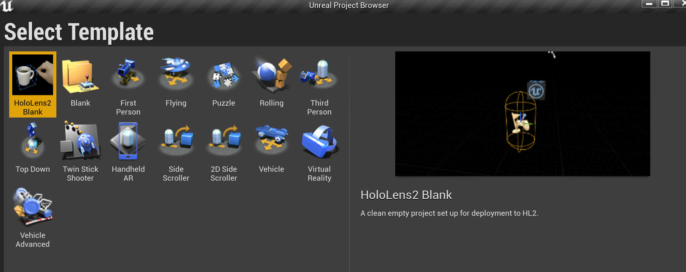

# HoloLens2 Unreal Project Template

This is a handy project template for Unreal Engine to create a project configured for `HoloLens 2`.
It includes the following:

- [Mixed Reality UX Tools and Examples](https://github.com/microsoft/MixedReality-UXTools-Unreal)

- [Mixed Reality Graphics Tools for Unreal](https://github.com/microsoft/MixedReality-GraphicsTools-Unreal)

- [Microsoft OpenXR for Unreal](https://github.com/microsoft/Microsoft-OpenXR-Unreal)

In order to install:

and run the following `git` command

> git clone --recurse-submodules https://github.com/peted70/hl2-ue-template.git

Then, copy the subfolder `DefaultHL2Template` and all of it's contents to `[Unreal install location]\[Unreal version]]\Templates`

This will copy the files for the template and the dependent plugins into your project templates. So when you create a new project you should see.

For further details see: https://peted.azurewebsites.net/hololens-2-unreal-project-template/

